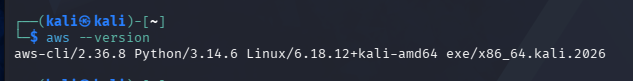

# Lab 0: Environment Setup & Verification

## Objective
To set up and verify a local cloud security laboratory environment on Kali Linux within VMware Workstation. This setup integrates containerization (Docker), local AWS cloud emulation (LocalStack), Kubernetes orchestration (`kind` and `kubectl`), AWS CLI v2, and cryptographic/authentication helper tools (`OpenSSL`, `oathtool`) to prepare for cloud security assessments.

---

## Learning Outcomes
* Configured local container runtime environments and verified permissions for non-root execution.
* Emulated AWS cloud services locally using LocalStack and verified CLI interaction through Security Token Service (STS) mock endpoints.
* Provisioned and verified a local single-node Kubernetes cluster using Kubernetes-in-Docker (`kind`).
* Diagnosed and resolved container socket permissions, image licensing issues, and virtual machine hardware resource allocation.

---

## Environment
* **Operating System:** Kali Linux 2026.1 (64-bit) running on VMware Workstation
* **Processor & Memory:** 2 CPU Cores / 4 GB RAM
* **Container Engine:** Docker CE v28.5.2
* **Kubernetes Environment:** `kind` v0.23.0 / `kubectl` v1.33.4
* **AWS Emulator:** LocalStack Community v3 (`localstack/localstack:3`)
* **AWS CLI:** AWS CLI v2.36.8
* **Helper Tools:** OpenSSL 3.6.2, oathtool 2.6.14

---

## Step-by-Step Implementation

### Step 1: Base Tooling & Helper Utilities Setup
Updated system repositories and installed basic packages along with security helper utilities (`OpenSSL` and `oathtool`) used for cryptographic tasks and MFA TOTP token generation.

### Step 2: Docker Engine Installation & Permission Management
Installed Docker Engine on Kali Linux, enabled the background daemon, and appended the local user (`kali`) to the `docker` security group to grant container management privileges without needing `sudo` privileges.

### Step 3: AWS CLI v2 Installation & LocalStack Emulation
Installed AWS CLI v2 for Linux. Configured dummy access credentials (`test`/`test`) and region parameters (`us-east-1`) to enable communication with local emulation endpoints. Launched the LocalStack Community container mapping port `4566` and verified endpoint health via curl.

### Step 4: Kubernetes (`kind` & `kubectl`) Deployment
Downloaded and configured executable binaries for `kind` and `kubectl`. Provisioned a local Kubernetes cluster named `ccse` and verified that the `ccse-control-plane` node reached a `Ready` state.

---

## Commands Used

### 1. Utility & System Packages Setup
```bash
sudo apt update && sudo apt upgrade -y
sudo apt install -y curl unzip git openssl oathtool docker.io
```

### 2.Docker Service & Permission Commands
```bash
# Enable and start Docker service
sudo systemctl enable --now docker
```
```bash
# Add user to docker group and refresh session
sudo usermod -aG docker $USER
newgrp docker
```

```bash
# Verify Docker functionality
docker run --rm hello-world
```

### 3. AWS CLI & LocalStack Commands

```bash
# Install AWS CLI v2
curl "[https://awscli.amazonaws.com/awscli-exe-linux-x86_64.zip](https://awscli.amazonaws.com/awscli-exe-linux-x86_64.zip)" -o "awscliv2.zip"
unzip awscliv2.zip
sudo ./aws/install
```

```bash
# Configure default dummy credentials
aws configure set aws_access_key_id test
aws configure set aws_secret_access_key test
aws configure set region us-east-1
```

```bash
# Launch LocalStack Community container
docker run -d --name localstack -p 4566:4566 localstack/localstack:3
```

```bash
# Health Check & STS Identity Verification
curl http://localhost:4566/_localstack/health
EP='--endpoint-url=http://localhost:4566'
aws $EP sts get-caller-identity
```

### 4. Kubernetes (kind / kubectl) Commands

```bash
# Install kind
curl -Lo ./kind [https://kind.sigs.k8s.io/dl/v0.23.0/kind-linux-amd64](https://kind.sigs.k8s.io/dl/v0.23.0/kind-linux-amd64)
chmod +x ./kind && sudo mv ./kind /usr/local/bin/kind
```

```bash
# Install kubectl
curl -LO "[https://dl.k8s.io/release/$(curl](https://dl.k8s.io/release/$(curl) -L -s [https://dl.k8s.io/release/stable.txt)/bin/linux/amd64/kubectl](https://dl.k8s.io/release/stable.txt)/bin/linux/amd64/kubectl)"
chmod +x ./kubectl && sudo mv ./kubectl /usr/local/bin/kubectl
```

```bash
# Cluster Operations
kind create cluster --name ccse
kubectl get nodes
```

--- 

## Screenshots

### 1. Installed Tool Versions (`kind`, `kubectl`, `openssl`, `oathtool`, `aws`)





### 2. LocalStack AWS STS Identity Verification


### 3. Active Kubernetes Node Status (`kind` Cluster)


--- 

## Challenges Encountered

### 1.Docker Socket Permission Denied:

Challenge: I encountered a permission error trying to access the /var/run/docker.sock in the beginning when i tried to run the docker run command.

Resolution: I then added thekali user to the docker group (sudo usermod -aG docker $USER) and reset the active group (newgrp docker).

### 2.LocalStack Container License Exit Code 55:

Challenge: I also experienced a bug where in the first attempt I would run the generic localstack/localstack without any tags, would receive an exit code 55 due to lack of LOCALSTACKAUTHTOKEN, and launch in Pro mode for a split second.

Resolution: I ran localstack/localstack:3 to ensure I ran the community open source version.

### 3.High CPU Usage on Host Machine:

Challenge: Windows Defender would scan every VMDK file continuously in the Kali's disk, raising the CPU Usage of the host to ~80%.

Resolution: Used a Powershell script to create a new folder exclusion for the Real-Time Protection using (Add-MpPreference).

---

## Lessons Learned

### 1. Local Cloud Isolation

Running local cloud simulators (LocalStack) and local Kubernetes control planes (kind) allows for safe, offline security testing without incurring cloud provider charges or exposing live infrastructure.

### 2. Image Tag Specificity

Explicitly tagging Docker images (e.g., using explicit community tags instead of implicit latest) prevents unexpected breaking changes or license enforcement during automated lab execution.