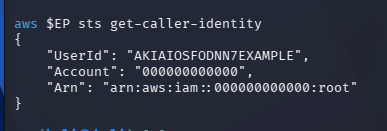
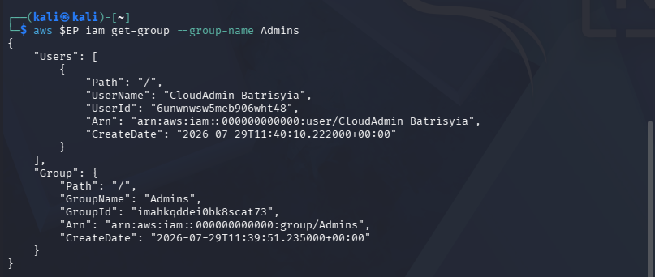
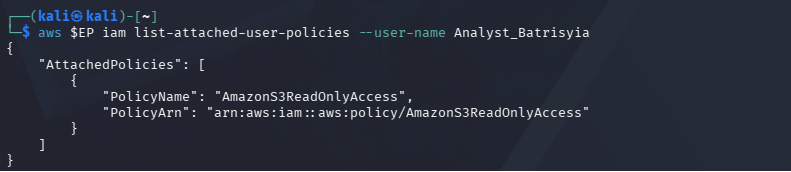
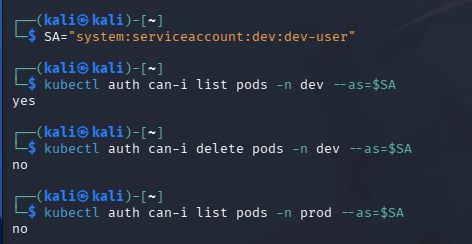

# Lab 1: Cloud Account Security, Identity & Access Management

## Objective
To apply identity governance and the principle of least privilege using LocalStack IAM and Kubernetes Role-Based Access Control (RBAC). This includes replacing root usage with scoped IAM identities, configuring fine-grained permissions, and enforcing platform-level access controls in a Kubernetes cluster.

---

## Learning Outcomes
* Applied the principle of least privilege by configuring scoped IAM users, groups, and managed policies.
* Practiced credential hygiene by provisioning, auditing, and deactivating programmatic access keys.
* Implemented Kubernetes RBAC to enforce isolation between development (`dev`) and production (`prod`) namespaces.
* Tested and audited identity permissions to distinguish allowed actions versus platform-enforced denials.

---

## Environment
* **OS:** Kali Linux 2026.1 (64-bit) on VMware Workstation / Windows Host
* **Container Engine:** Docker CE
* **Cloud Emulation:** LocalStack Community Engine (`localstack/localstack`)
* **Container Orchestration:** `kind` (Kubernetes-in-Docker) / `kubectl`
* **AWS CLI:** AWS CLI v2

---

## Task 1: Cloud Identity Landscape Mapping

| Concept | AWS Term | Purpose |
| :--- | :--- | :--- |
| **All-powerful owner** | Root user | Complete, unrestricted administrative control over the entire cloud account; used strictly for initial account setup and sensitive billing tasks. |
| **Human/app identity** | IAM User | An identity created within AWS that represents a specific person or application requiring long-term access to interact with resources. |
| **Permission bundle** | IAM Policy | A JSON document that explicitly defines allowed or denied actions/resources for identities. |
| **Collection of users** | IAM Group | A logical container used to attach permissions to multiple users simultaneously for centralized management. |
| **Temporary identity** | IAM Role | An identity with dynamic, short-lived security credentials assumed by users, services, or applications. |

---

## Step-by-Step Implementation & Commands Used

### 1. Environment Setup & LocalStack Verification
Started LocalStack and configured dummy credentials to verify connectivity against local emulated endpoints:
```bash
docker run -d --name localstack -p 4566:4566 localstack/localstack
aws configure set aws_access_key_id test
aws configure set aws_secret_access_key test
aws configure set region us-east-1

EP='--endpoint-url=http://localhost:4566'
aws $EP sts get-caller-identity
```

### 2. Least-Privilege Admin Setup (Task 2)
Created an Admins group with administrator access and added a personal admin user to practice group-based permission mapping:
```bash
aws $EP iam create-group --group-name Admins
aws $EP iam attach-group-policy --group-name Admins --policy-arn arn:aws:iam::aws:policy/AdministratorAccess
aws $EP iam create-user --user-name CloudAdmin_Batrisyia
aws $EP iam add-user-to-group --group-name Admins --user-name CloudAdmin_Batrisyia
aws $EP iam get-group --group-name Admins
```

### 3. Fine-Grained Authorization (Task 3)
Created a scoped read-only user restricted strictly to S3 read capabilities:
```bash
aws $EP iam create-user --user-name Analyst_Batrisyia
aws $EP iam attach-user-policy --user-name Analyst_Batrisyia --policy-arn arn:aws:iam::aws:policy/AmazonS3ReadOnlyAccess
aws $EP iam list-attached-user-policies --user-name Analyst_Batrisyia
```

### 4. Credential Hygiene & Access Key Rotation (Task 4)
Generated programmatic credentials for the analyst user and deactivated the key to simulate credential rotation:
```bash
aws $EP iam create-access-key --user-name Analyst_Batrisyia
aws $EP iam list-access-keys --user-name Analyst_Batrisyia
aws $EP iam update-access-key --user-name Analyst_Batrisyia --access-key-id <KEY_ID> --status Inactive
aws $EP iam list-access-keys --user-name Analyst_Batrisyia
```

### 5. Kubernetes RBAC Setup & Enforcement (Tasks 5–7)
Spun up a local Kubernetes cluster, separated dev and prod environments, and configured a role bound to a service account[cite: 2]:
```bash
kind create cluster --name ccse-lab1
kubectl create namespace dev
kubectl create namespace prod

kubectl create serviceaccount dev-user -n dev
kubectl create role pod-reader -n dev --verb=get,list,watch --resource=pods
kubectl create rolebinding dev-user-binding -n dev --role=pod-reader --serviceaccount=dev:dev-user

SA="system:serviceaccount:dev:dev-user"
kubectl auth can-i list pods -n dev --as=$SA
kubectl auth can-i delete pods -n dev --as=$SA
kubectl auth can-i list pods -n prod --as=$SA
```

## Screenshots
### 1. Caller Identity Output (sts get-caller-identity)
### 2. Admin Group Membership Verification 
### 3. Analyst Attached Read-Only Policy 
### 4. Kubernetes RBAC Authorization Test Results 

## Verification Command Output
Output of kubectl get rolebinding dev-user-binding -n dev -o yaml:
```bash
apiVersion: rbac.authorization.k8s.io/v1
kind: RoleBinding
metadata:
  creationTimestamp: "2026-08-03T01:17:19Z"
  name: dev-user-binding
  namespace: dev
  resourceVersion: "804"
  uid: 52f402a3-4882-4a59-9cec-56864df90fb8
roleRef:
  apiGroup: rbac.authorization.k8s.io
  kind: Role
  name: pod-reader
subjects:
- kind: ServiceAccount
  name: dev-user
  namespace: dev
```

## Deliverables & Short-Answer Questions
### Q1. Why is attaching policies to groups better than attaching them directly to users?
Using groups makes auditing permissions easier as well as scaling this up in the environment. When the user privileges need to change, the group only need to be changed once by the administrator rather than having to update the privilege for every user and introducing potential configuration drift.

### Q2. What is the difference between an IAM User and an IAM Role?
An IAM User: Persistent Identity and Permanent Credentials (passwords/long lived access key).
An IAM Role: Temporary Identity Assumable by Users or services; Issues Short-Lived Security Credentials. No long lived or hardcoded access keys to worry about.

### Q3. Explain least privilege using the Analyst account, and how it reduces blast radius if compromised.
By attaching the AmazonS3ReadOnlyAccess policy to the Analyst user identity will only ever be able to see S3 data, and without the ability to create, modify, write ordelete data or resources in S3 or any other cloud service. Should this account be compromised the attacker will not be able to damage resources or data, nor gain additional privileges which drastically reduces the blast radius.

### Q4. In Kubernetes, what is the difference between a Role and a RoleBinding?
A Role contains permissions (allowed HTTP verbs and Kubernetes API resources) at the namespace level, while RoleBinding binds those permissions to Subjects within the namespace (for example, ServiceAccounts or Users).

### Q5. Why did the developer service account fail to access prod, and which security principle does that demonstrate?
“The dev-user ServiceAccount could not reach prod because the pod-reader Role was made in the dev namespace only, with the dev-user-binding also made only to in the dev namespace”. KubernetesRBAC also supportsnamespacebound accesses and is another example of least privilege/default deny-auth.

## Challenges Encountered
### 1. Terminal Syntax Error on Access Key Rotation:

* Issue: Running aws update-access-key with raw angle brackets (<KEY_ID>) caused zsh to interpret the command as a file redirection error (zsh: no such file or directory).

* Resolution: Re-ran the command after removing the < > brackets and providing the literal AccessKeyId string directly.

### 2. LocalStack Connection Timeout:

* Issue: aws $EP sts get-caller-identity threw a connection error when LocalStack was not active in Docker.

* Resolution: Restarted the container using docker run -d --name localstack -p 4566:4566 localstack/localstack and verified readiness via the /_localstack/health endpoint.

## Lessons Learned
* Implementing group-based policy assignment reduces administrative overhead and ensures consistent access governance.

* Platform-level enforcement (such as Kubernetes RBAC) provides strict default-deny authorization boundaries that prevent unintended cross-environment access.

## References
* LocalStack IAM Documentation: https://docs.localstack.cloud/

* Kubernetes RBAC Documentation: https://kubernetes.io/docs/reference/access-authn-authz/rbac/

* AWS IAM Best Practices: https://docs.aws.amazon.com/IAM/latest/UserGuide/best-practices-concepts.html